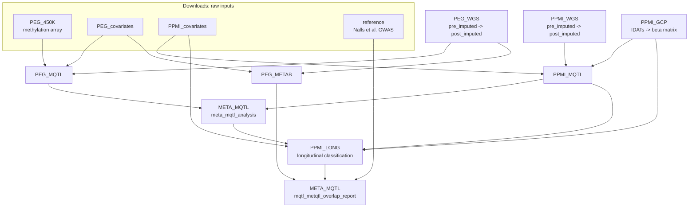

# PD-QTLs

## Pipeline Overview

Two cohorts (PEG, PPMI) each go through genotype imputation and an omics
pipeline (methylation and/or metabolomics), producing per-cohort mQTL/metQTL
results. `META_MQTL` combines the cohort-level mQTL results into a
meta-analysis, `PPMI_LONG` re-tests the meta-analysis hits longitudinally in
PPMI, and a second `META_MQTL` step overlaps everything (metQTLs, longitudinal
classification, PD GWAS loci) into the final hit tables.



## Repository Structure

Only `pipelines/` (scripts, Snakefiles, configs, docs) is checked into git.
`Downloads/`, `results/`, and `archive/` hold real data, are gitignored, and
sync to the "PD QTLs" box.ucla.edu folder separately.

```
PD-QTLs/
├── README.md
├── Downloads/     # raw/input data, one subdir per pipeline (gitignored)
├── pipelines/     # scripts + docs only, mirrors Downloads/results names (tracked in git)
├── results/       # pipeline outputs, one subdir per pipeline (gitignored)
└── archive/       # superseded/unused scripts and data, kept but out of the way (gitignored)
```

Each pipeline's scripts live at `pipelines/<NAME>/`, with matching data at
`Downloads/<NAME>/` and `results/<NAME>/`. Some pipelines (`PEG_WGS`,
`PPMI_WGS`) are split further into `pre_imputed/` and `post_imputed/` stages.
Current pipelines: `META_MQTL`, `PEG_METAB`, `PEG_MQTL`, `PEG_WGS`,
`PPMI_GCP`, `PPMI_LONG`, `PPMI_MQTL`, `PPMI_WGS`. `PEG_450K`, `PEG_covariates`,
and `PPMI_covariates` are input-only (Downloads has no matching pipelines/
entry). Scripts reference cross-pipeline data with paths relative to repo
root, e.g. `../../results/PEG_MQTL/...` from `pipelines/META_MQTL/`.
